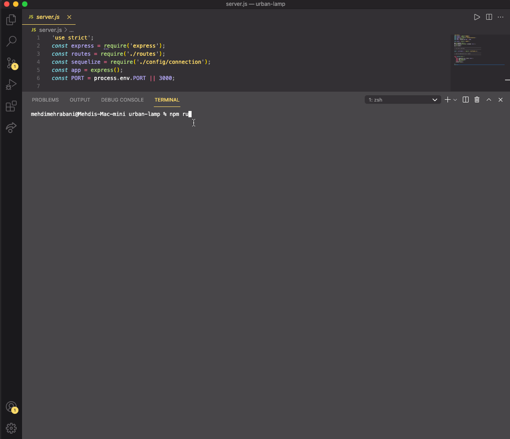
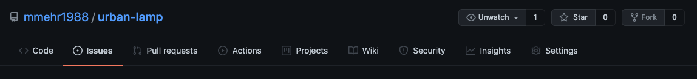

# urban-lamp

# super-octo-bassoon

## Project Title: Team Profile Generator

<a href="https://choosealicense.com/licenses/mit" target="_blank"></a>

## Table of Contents:

1. [Description](#description)
1. [Technologies](#technologies)
1. [Installation](#installation)
1. [Usage](#usage)
1. [Video](#video)
1. [Contributing](#contributing)
1. [License](#license)
1. [Questions](#questions)

## Description

This is a Node.js command-line application that utilizes Sequelize to interact with MySQL to manage a company's employee database.

## Technologies

1. [Node.js](https://www.npmjs.com/package/inquirer)

   a. [Inquirer Package](https://www.npmjs.com/package/inquirer)

   b. [MySQL2](https://www.npmjs.com/package/mysql2)

   c. [Sequelize](https://www.npmjs.com/package/sequelize)

   d. [Express](https://www.npmjs.com/package/express)

   e. [Dotenv](https://www.npmjs.com/package/dotenv)

   f. [console.table](https://www.npmjs.com/package/console.table)

   g. [Chalk Package](https://www.npmjs.com/package/chalk)

## Installation

- Before cloning the repository, please ensure you have node.js installed as this is a command line application. If you do not have node.js installed, start with steps 1 and 2. If you have node.js installed and confirmed, you can skip steps 1 and 2 and begin on step 3.

  1.  [Node.js Download Page](https://nodejs.org/en/download/)

  2.  After install, check with command line to ensure setup is correct.

      a. Open your terminal

      b. Type the below command. If you see a version it means you have installed node.js correctly.

      ```bash
      node -v
      ```

  3.  Clone repository and open in VS Code.

  4.  Open Terminal in VS Code

      a. Shortcut = CTRL + `

  5.  Install all the dependencies by typing the below command.

      ```bash
      npm install
      ```

  6.  Once you hit enter, the correct dependencies for allowing you to use this application will be automatically installed.

  7.  The final step is to update the .env.EXAMPLE file with your MySQL password and user info. Please ensure you also remove the ".EXAMPLE" from the file path.

## Usage

- Once you've completed the installation section guidelines, to run the application type the below command.

  ```bash
  node server.js
  ```

- If you would like to use the example company employees, I've placed a json file in the seeds folder and you can save the data to MySQL by running the below command.

  ```bash
    npm run seeds
  ```

## Video

[Link To GIF ](https://github.com/mmehr1988/urban-lamp/blob/main/gif/employee-tracker.gif)



## Contributing

Please open a Github issues request and I’ll review and respond as soon as I can. See below image for where to find the Issue page.



## License

<a href="https://choosealicense.com/licenses/mit" target="_blank">MIT License</a>

## Questions

Github Portfolio Link: [Mehdi Mehrabani](https://github.com/mmehr1988)<br>
Email Contact: tatash.my@gmail.com
